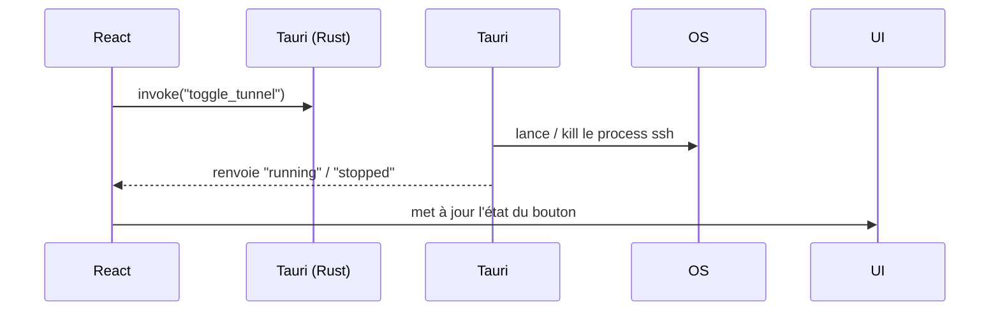
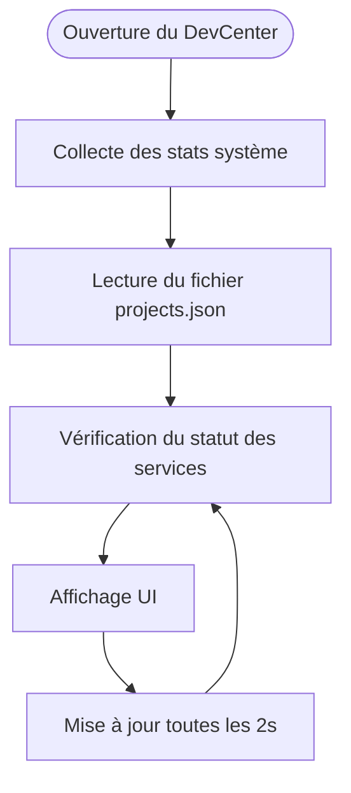

# Architecture de GestionMax DevCenter

Cette documentation présente l'architecture interne actuelle du projet  
(uniquement la version locale Tauri + React, sans backend externe).

---

## 1. Structure globale

L'app est composée de 2 couches :

```
┌───────────────────────────────┐
│ React Frontend                │
│ (interface graphique du toolkit)│
└─────────────▲─────────────────┘
              │ invoke()
┌─────────────▼─────────────────┐
│ Rust (Tauri Backend)          │
│ - exécution de commandes OS   │
│ - gestion des process         │
│ - collecte des metrics        │
└───────────────────────────────┘
```

---

## 2. Flux principal



---

## 3. Communication IPC

→ React ne peut pas exécuter de commandes système.  
→ Il utilise Tauri :

```typescript
import { invoke } from "@tauri-apps/api/core";

await invoke("toggle_backend");
```

→ Rust exécute la logique système, ex :

```rust
Command::new("pnpm")
   .arg("dev")
   .spawn()
```

---

## 4. Backend Rust (Rôle)

Rust s'occupe de :

- lancer/stopper des process (Next, Payload, Netdata…)
- gérer le tunnel SSH
- lire l'utilisation CPU / RAM / disque
- tuer les zombies
- détecter l'état des projets

L'application ne dépend d'aucun service externe.

**Scripts embarqués** : Tous les scripts de gestion des services sont maintenant embarqués dans le bundle Tauri et se trouvent dans `src-tauri/resources/scripts/`. Plus besoin de scripts externes dans `~/scripts/dev-tools/`.

---

## 5. Frontend React

React s'occupe de :

- interface graphique
- affichage des stats
- boutons ON/OFF
- liste des projets
- indicateurs d'état (running/stopped)

Styling assuré par TailwindCSS.

---

## 6. Cycle d'exécution du dashboard



### 6.1. Architecture des services

Le Dashboard distingue deux types de services :

**Services globaux** (section "Services globaux") :
- **Tunnel SSH** : Un seul tunnel partagé pour tous les projets
- **Netdata** : Un seul instance de monitoring pour tout le système
- Ces services sont contrôlés depuis la section globale du Dashboard

**Services de projet** (dans chaque carte de projet) :
- **Backend** : Spécifique à chaque projet (chaque projet a son propre backend)
- **Frontend** : Spécifique à chaque projet (chaque projet a son propre frontend)
- **Netdata** : Peut être configuré par projet (mais généralement partagé)
- Ces services sont contrôlés depuis la carte de chaque projet

**Pourquoi cette séparation ?**
- Avec plusieurs projets, chaque projet a ses propres backend/frontend sur des ports différents
- Le Tunnel SSH et Netdata sont vraiment globaux (un seul par machine)
- Cette architecture évite la confusion : on sait clairement quel service appartient à quel projet

## 6.1. Modules de gestion de projets

### Project Manager

Le module **Project Manager** permet de gérer manuellement les projets :

- **Fichier de configuration** : `~/.gestionmax-devcenter/projects.json`
- **Format JSON** :
  ```json
  {
    "projects": [
      {
        "name": "GestionMax OPS",
        "backend_path": "/path/to/backend",
        "frontend_path": "/path/to/frontend",
        "scripts_path": "/path/to/scripts",
        "services": {
          "tunnel": { "start": "tunnel.sh", "stop": "tunnel-off.sh" },
          "backend": { "start": "start-dev.sh backend", "port": 3010 },
          "frontend": { "start": "start-dev.sh frontend", "port": 3000 },
          "netdata": { "start": "netdata-on.sh", "stop": "netdata-off.sh", "port": 19999 }
        }
      }
    ]
  }
  ```

### Auto-Detection Project Scanner

Le module **Auto-Scan** détecte automatiquement la structure d'un projet :

1. **Sélection du dossier** : Via `pick_project_folder()` (zenity sur Linux)
2. **Analyse automatique** :
   - Détection Backend Payload (recherche dans `backend/`, `back/`, `api/`, `server/`)
   - Détection Frontend Next.js (recherche dans `frontend/`, `front/`, `web/`, `app/`)
   - Détection des scripts (tunnel.sh, start-dev.sh, etc.)
   - Détection des ports (`.env`, `payload.config.ts`, `next.config.js`, `package.json`)
3. **Configuration automatique** :
   - Netdata toujours configuré (port 19999 fixe)
   - Services détectés automatiquement
4. **Génération** : Crée un objet `Project` complet prêt à être enregistré

---

## 7. Structure des fichiers

### Frontend (React)

- `src/App.tsx` : Point d'entrée avec routing
- `src/pages/Dashboard.tsx` : Page principale avec vue compacte des projets
- `src/pages/Logs.tsx` : Affichage des logs système
- `src/pages/Configuration/` : Gestion des projets
  - `ProjectManager.tsx` : Interface CRUD pour les projets
  - `AutoScanProject.tsx` : Auto-détection de projets
- `src/components/` : Composants réutilisables
  - `ProjectCompactView.tsx` : Vue compacte des projets
  - `ProjectForm.tsx` : Formulaire d'édition de projet
  - `AutoScanSummary.tsx` : Résumé du scan automatique
- `src/hooks/` : Hooks React personnalisés
  - `useProjects.ts` : Gestion des projets avec polling
- `src/lib/` : Utilitaires et fonctions
  - `projectManager.ts` : Fonctions pour gérer les projets
  - `autoscan.ts` : Fonctions pour l'auto-détection
  - `projectConverter.ts` : Conversion entre formats
- `src/types/` : Types TypeScript
  - `Project.ts` : Types pour les projets

### Backend (Rust)

- `src-tauri/src/lib.rs` : Configuration Tauri
- `src-tauri/src/commands.rs` : Commandes système exposées à React
- `src-tauri/src/state.rs` : Gestion de l'état global (PIDs des services)
- `src-tauri/src/projects.rs` : Gestion des projets (CRUD)
- `src-tauri/src/autoscan.rs` : Auto-détection de la structure des projets

---

## 8. Gestion d'état

- **État local** : `useState` pour les composants simples
- **Polling** : `useEffect` + `setInterval` pour les mises à jour en temps réel
- **Toasts** : Système de notifications via Shadcn UI

---

## 9. Sécurité

- Tauri isole le backend Rust du frontend React
- Les commandes système sont exécutées uniquement via Rust
- Pas d'accès direct au système depuis React (sandbox)

---

## 10. Performance

- **Polling** : Mise à jour toutes les 2 secondes pour les stats
- **Lazy loading** : Composants chargés à la demande
- **Optimisations Rust** : Exécution native, pas de surcharge JS

